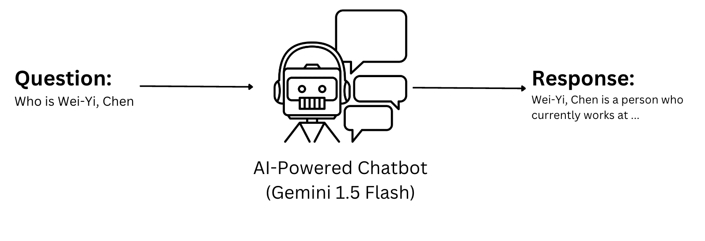
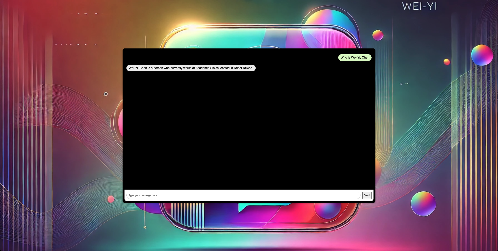

# my-chat-bot
## Intro
- This repository contains an information chatbot that provides details about me. I use my personal information to fine-tune the Gemini 1.5 model for this chatbot.
- If you're interested in checking out my repository, you can visit it using this [link](https://a346-140-109-22-171.ngrok-free.app)

## Overview


## Requirements
- Gemini 1.5 Flash Access Key
  - Ref: https://deepmind.google/technologies/gemini/
- Flask

## Fine-Tuning
- Prepare personal information and follow the format below.
```
training_data = [
  {"text_input": "1", "output": "2"},
  {"text_input": "3", "output": "4"},
  {"text_input": "-3", "output": "-2"},
  ...
]
```
- More hyperparameters please refer below link
  - Ref: https://ai.google.dev/gemini-api/docs/model-tuning

## UI


## Note
- The background image is generated by ChatGPT-4o
